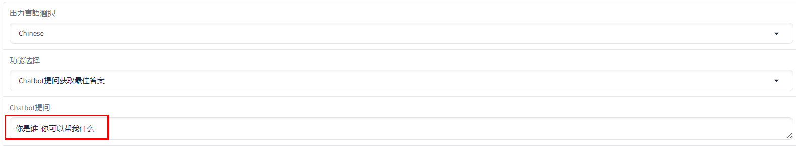
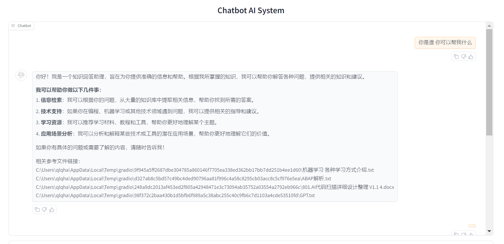

<!-- Improved compatibility of back to top link: See: https://github.com/othneildrew/Best-README-Template/pull/73 -->
<a id="readme-top"></a>
<!--
*** Thanks for checking out the Best-README-Template. If you have a suggestion
*** that would make this better, please fork the repo and create a pull request
*** or simply open an issue with the tag "enhancement".
*** Don't forget to give the project a star!
*** Thanks again! Now go create something AMAZING! :D
-->


<!-- PROJECT SHIELDS -->
<!--
*** I'm using markdown "reference style" links for readability.
*** Reference links are enclosed in brackets [ ] instead of parentheses ( ).
*** See the bottom of this document for the declaration of the reference variables
*** for contributors-url, forks-url, etc. This is an optional, concise syntax you may use.
*** https://www.markdownguide.org/basic-syntax/#reference-style-links
-->
[![Contributors][contributors-shield]][contributors-url]
[![Forks][forks-shield]][forks-url]
[![Stargazers][stars-shield]][stars-url]
[![Issues][issues-shield]][issues-url]
[![MIT License][license-shield]][license-url]
[![LinkedIn][linkedin-shield]][linkedin-url]


<!-- PROJECT LOGO -->
<br />
<div align="center">
  <a href="https://github.com/qiulongquan/graph_rag">
    
  </a>

  <h3 align="center">Graph RAG信息检索系统</h3>

  <p align="center">
    快速部署，简单操作，精度高的AI检索系统!
    <br />
    <a href="https://github.com/qiulongquan/graph_rag"><strong>Explore the docs »</strong></a>
    <br />
    <br />
    <a href="https://www.youtube.com/watch?v=qXB7xpNiLc0">View Demo</a>
    ·
    <a href="https://github.com/qiulongquan/graph_rag/issues/new?labels=bug&template=bug-report---.md">Report Bug</a>
    ·
    <a href="https://github.com/qiulongquan/graph_rag/issues/new?labels=enhancement&template=feature-request---.md">Request Feature</a>
  </p>
</div>


<!-- TABLE OF CONTENTS -->
<details>
  <summary>Table of Contents</summary>
  <ol>
    <li>
      <a href="#about-the-project">About The Project</a>
      <ul>
        <li><a href="#built-with">Built With</a></li>
      </ul>
    </li>
    <li>
      <a href="#getting-started">Getting Started</a>
      <ul>
        <li><a href="#prerequisites">Prerequisites</a></li>
        <li><a href="#installation">Installation</a></li>
      </ul>
    </li>
    <li><a href="#usage">Usage</a></li>
    <li><a href="#roadmap">Roadmap</a></li>
    <li><a href="#contributing">Contributing</a></li>
    <li><a href="#license">License</a></li>
    <li><a href="#contact">Contact</a></li>
    <li><a href="#acknowledgments">Acknowledgments</a></li>
  </ol>
</details>


<!-- ABOUT THE PROJECT -->
## About The Project

#### 提问后检索内容并在10秒左右按照便于理解的格式输出
[![Product Name Screen Shot][product-screenshot1]](https://github.com/qiulongquan/graph_rag)
#### 检索内容对应的图片输出
[![Product Name Screen Shot][product-screenshot2]](https://github.com/qiulongquan/graph_rag)

这个项目出发点是通过高精度，便于快速部署，使用容易，服务于中小企业和个人的AI检索系统。
1. 可以处理常用的日常办公软件比如(pptx,docx,xlsx,pdf,txt)文档的检索。
2. 可以处理python代码的code解析检索。
3. 通过Docker快速创建Neo4j图数据库。
4. 通过Graph RAG系统导入文件一键导入图数据库中。
5. 在Graph RAG系统的Gradio页面快速检索问题，所有的目的都是快速容易精准的获取想要的信息。

希望你喜欢这个产品。

这个产品是开源产品，代码力求精简。现在也许还有很多不足的地方如果你是一个有热心的开发者可以一起完善这个产品。


<!-- Use the `BLANK_README.md` to get started. -->

<p align="right">(<a href="#readme-top">back to top</a>)</p>


## Built With

下面是程序中用到的python库或者开发框架

* [![LlamaIndex][LlamaIndex.com]][LlamaIndex-url]
* [![Gradio][Gradio.com]][Gradio-url]
* [![Neo4j][Neo4j.com]][Neo4j-url]
* [![Claude3][Claude3.com]][Claude3-url]
* [![OpenAI][OpenAI.com]][OpenAI-url]
* [![FastAPI][FastAPI.com]][FastAPI-url]
* [![Bootstrap][Bootstrap.com]][Bootstrap-url]
* [![JQuery][JQuery.com]][JQuery-url]


<p align="right">(<a href="#readme-top">back to top</a>)</p>


## 产品介绍视频
Graph RAG检索系统进阶介绍，超过传统RAG检索系统  
https://www.youtube.com/watch?v=zh6gqaMkdNs

Graph RAG添加上下文检索流式输出图片检索输出功能，快速落地提高商用价值  
https://www.youtube.com/watch?v=ZNxmLOS2eo4

Graph RAG检索系统添加代码解析检索功能，可以让新手小白快速了解复杂代码逻辑  
https://www.youtube.com/watch?v=pLT56NQ8hmM

graph rag系统部署以及neo4j图数据库安装说明  
https://www.youtube.com/watch?v=--w2d9pe1dg

<!-- GETTING STARTED -->
## Getting Started

注册并获取Anthropic账号以及Openai账号并替换下面的Key  
os.environ["OPENAI_API_KEY"] = "sk-XXXXXXXX"  
os.environ['ANTHROPIC_API_KEY'] = "sk-XXXXXX"

### Prerequisites

* 安装本地Neo4j 采用docker方式 执行下面的命令 (命令中的 123456abc 是初始密码可以自由调整但是程序中的登陆密码也需要相同设定)
  ```sh
  docker run -p 7474:7474 -p 7687:7687 -d  -e NEO4J_AUTH=neo4j/123456abc  -v $PWD/data_neo4j:/data -v $PWD/plugins:/plugins --name neo4j-apoc -e NEO4J_apoc_export_file_enabled=true -e NEO4J_apoc_import_file_enabled=true -e NEO4J_apoc_import_file_use__neo4j__config=true -e NEO4J_PLUGINS=\[\"apoc\"\]  -e NEO4J_dbms_security_procedures_unrestricted=apoc.*  neo4j:latest
  ```
* 安装后启动docker中的neo4j服务 (确认neo4j图数据库启动正常是必须的操作)
[![Product Name Screen Shot][product-screenshot3]](https://github.com/qiulongquan/graph_rag)
### Installation

_github下载本程序所有代码并启动程序._

1. Clone the repo
   ```sh
   git clone https://github.com/qiulongquan/graph_rag.git
   ```
2. Python 环境
   ```sh
   Python环境需要 python==3.11
   ```
3. Install gradio packages
   ```sh
   pip install gradio==4.44.1
   ```
4. 使用你的 openai key 和 Anthropic key 替换下面的2个Key
   ```sh
   os.environ["OPENAI_API_KEY"] = "sk-XXXXXXXX"  
   os.environ['ANTHROPIC_API_KEY'] = "sk-XXXXXX"
   ```
5. 启动程序
   ```sh
   python graph_rag_query.py
   ```
6. 本地启动的话直接浏览器输入  
   [127.0.0.1:7860](http://127.0.0.1:7860/)  

7. 启动页面确认  
[![Product Name Screen Shot][product-screenshot4]](https://github.com/qiulongquan/graph_rag)

<p align="right">(<a href="#readme-top">back to top</a>)</p>


<!-- USAGE EXAMPLES -->
## Usage

1. 启动程序后，浏览器输入http://127.0.0.1:7860/将可以看到下面的页面
[![Product Name Screen Shot][product-screenshot4]](https://github.com/qiulongquan/graph_rag)

2. 输入想要查询的问题，点击【提交请求】按钮。


3. 等待10秒左右就会开始在在屏幕上面流式输出答案。这很棒，非常简单！


_如果你需要查询自定义的文件内容，需要先选择【提交文件及数据处理】然后把自定义文件上传并处理存储到图数据库中，然后就可以进行查询了。_

#### 关于部署我制作了详细的说明视频，可以查看下面链接。
<a href="https://www.youtube.com/watch?v=--w2d9pe1dg">部署讲解视频</a>

<p align="right">(<a href="#readme-top">back to top</a>)</p>


<!-- ROADMAP -->
## Roadmap

- [x] 提高处理速度并行处理
- [x] 可以处理txt excel pdf word ppt 这样的文件
- [x] 实现流式输出
- [x] 相关检索内容图片信息输出
- [x] 上下文综合检索回答能力

如果有bug或者需要进一步深度开发请发布issue或者发邮件联系我

See the [open issues](https://github.com/othneildrew/Best-README-Template/issues) for a full list of proposed features (and known issues).

<p align="right">(<a href="#readme-top">back to top</a>)</p>


<!-- CONTRIBUTING -->
## Contributing

Contributions are what make the open source community such an amazing place to learn, inspire, and create. Any contributions you make are **greatly appreciated**.

If you have a suggestion that would make this better, please fork the repo and create a pull request. You can also simply open an issue with the tag "enhancement".
Don't forget to give the project a star! Thanks again!

1. Fork the Project
2. Create your Feature Branch (`git checkout -b feature/AmazingFeature`)
3. Commit your Changes (`git commit -m 'Add some AmazingFeature'`)
4. Push to the Branch (`git push origin feature/AmazingFeature`)
5. Open a Pull Request

### Top contributors:


<p align="right">(<a href="#readme-top">back to top</a>)</p>


<!-- LICENSE -->
## License

Distributed under the MIT License. See `LICENSE.txt` for more information.

<p align="right">(<a href="#readme-top">back to top</a>)</p>


<!-- CONTACT -->
## Contact

Your Name - [@qiulongquan](https://twitter.com/qiulongquan) - qiulongquan19851234@gmail.com

Project Link: [https://github.com/qiulongquan/graph_rag](https://github.com/qiulongquan/graph_rag)

<p align="right">(<a href="#readme-top">back to top</a>)</p>


<!-- ACKNOWLEDGMENTS -->
## Acknowledgments

Use this space to list resources you find helpful and would like to give credit to. I've included a few of my favorites to kick things off!

* [微软知识图谱](https://microsoft.github.io/graphrag/)
* [Neo4j 图数据库](https://neo4j.com/)
* [Docker 部署Neo4j 图数据库方法](https://www.oryoy.com/news/shi-yong-docker-zai-fu-wu-qi-shang-bu-shu-he-pei-zhi-neo4j-tu-shu-ju-ku-de-zui-jia-shi-jian.html)
* [Llamaindex 搭配Neo4j 图数据库](https://docs.llamaindex.ai/en/stable/examples/property_graph/property_graph_neo4j/)
* [Neo4j 使用Llamaindex](https://neo4j.com/labs/genai-ecosystem/llamaindex/)
* [【Graph RAG】如何为LlamaIndex配置Neo4j Store](https://www.bilibili.com/read/cv29118130/)

<p align="right">(<a href="#readme-top">back to top</a>)</p>


<!-- MARKDOWN LINKS & IMAGES -->
<!-- https://www.markdownguide.org/basic-syntax/#reference-style-links -->
[contributors-shield]: https://img.shields.io/github/contributors/othneildrew/Best-README-Template.svg?style=for-the-badge
[contributors-url]: https://github.com/othneildrew/Best-README-Template/graphs/contributors
[forks-shield]: https://img.shields.io/github/forks/othneildrew/Best-README-Template.svg?style=for-the-badge
[forks-url]: https://github.com/othneildrew/Best-README-Template/network/members
[stars-shield]: https://img.shields.io/github/stars/othneildrew/Best-README-Template.svg?style=for-the-badge
[stars-url]: https://github.com/othneildrew/Best-README-Template/stargazers
[issues-shield]: https://img.shields.io/github/issues/othneildrew/Best-README-Template.svg?style=for-the-badge
[issues-url]: https://github.com/othneildrew/Best-README-Template/issues
[license-shield]: https://img.shields.io/github/license/othneildrew/Best-README-Template.svg?style=for-the-badge
[license-url]: https://github.com/othneildrew/Best-README-Template/blob/master/LICENSE.txt
[linkedin-shield]: https://img.shields.io/badge/-LinkedIn-black.svg?style=for-the-badge&logo=linkedin&colorB=555
[linkedin-url]: https://linkedin.com/in/othneildrew
[Next.js]: https://img.shields.io/badge/next.js-000000?style=for-the-badge&logo=nextdotjs&logoColor=white
[Next-url]: https://nextjs.org/
[React.js]: https://img.shields.io/badge/React-20232A?style=for-the-badge&logo=react&logoColor=61DAFB
[React-url]: https://reactjs.org/
[Vue.js]: https://img.shields.io/badge/Vue.js-35495E?style=for-the-badge&logo=vuedotjs&logoColor=4FC08D
[Vue-url]: https://vuejs.org/
[Angular.io]: https://img.shields.io/badge/Angular-DD0031?style=for-the-badge&logo=angular&logoColor=white
[Angular-url]: https://angular.io/
[Svelte.dev]: https://img.shields.io/badge/Svelte-4A4A55?style=for-the-badge&logo=svelte&logoColor=FF3E00
[Svelte-url]: https://svelte.dev/
[Laravel.com]: https://img.shields.io/badge/Laravel-FF2D20?style=for-the-badge&logo=laravel&logoColor=white
[Laravel-url]: https://laravel.com
[Bootstrap.com]: https://img.shields.io/badge/Bootstrap-563D7C?style=for-the-badge&logo=bootstrap&logoColor=white
[Bootstrap-url]: https://getbootstrap.com
[JQuery.com]: https://img.shields.io/badge/jQuery-0769AD?style=for-the-badge&logo=jquery&logoColor=white
[JQuery-url]: https://jquery.com
[Neo4j.com]: https://img.shields.io/badge/Neo4j-008CC1?style=for-the-badge&logo=neo4j&logoColor=white
[Neo4j-url]: https://neo4j.com/
[Claude3.com]: https://img.shields.io/badge/Claude3-4A90E2?style=for-the-badge&logo=claude&logoColor=white
[Claude3-url]: https://www.anthropic.com/
[OpenAI.com]: https://img.shields.io/badge/OpenAI-412991?style=for-the-badge&logo=openai&logoColor=white
[OpenAI-url]: https://openai.com/
[FastAPI.com]: https://img.shields.io/badge/FastAPI-009688?style=for-the-badge&logo=fastapi&logoColor=white
[FastAPI-url]: https://fastapi.tiangolo.com/
[LlamaIndex.com]: https://img.shields.io/badge/LlamaIndex-FF5A1F?style=for-the-badge&logo=llamaindex&logoColor=white
[LlamaIndex-url]: https://llamaindex.ai/
[Gradio.com]: https://img.shields.io/badge/Gradio-3776AB?style=for-the-badge&logo=gradio&logoColor=white
[Gradio-url]: https://gradio.app/
[product-screenshot1]: images/retrieval_1.png
[product-screenshot2]: images/retrieval_2.png
[product-screenshot3]: images/docker_sample.png
[product-screenshot4]: images/retrieval_4.png